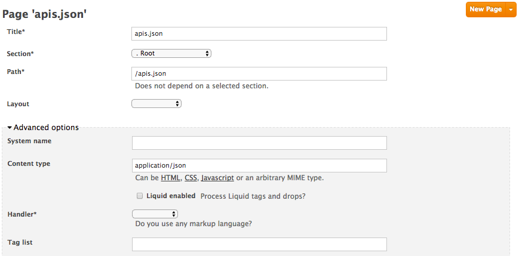

# API discovery and search experience in your developer portal

For the last few years the API community has been doing research around the best ways for humans and services to catalog APIs automatically inside an organization.
The challenge is getting harder and harder, as companies are getting more API-driven, with hundreds of services spread in the whole organizations.

There are few solutions that exist like Netflix [] or [], and sometimes related to orchestration and scalability.

We decided on a different approach, partnering with API Evangelist to launch in 2014 the `apis.json` format at [Gluecon](https://www.programmableweb.com/news/apis.io-and-apis.json-launched-gluecon-to-make-api-discoverability-more-search/2014/05/21). The idea is to build something as simple as `robots.txt` for websites but for APIs.
It does not matter the language used to build the APIs, on which platform it runs or which container it runs.

With the launch of `APIs.json` we also launched APIs.io, the search engine for APIs.
Now we are happy announce you can have a similar experience on your developer portal.
Being able to list all your apis, and let your users search easily through them.

You can try a working demo [here]()

## Prerequesites
- Swagger, ActiveDocs
- 


## Build APIs.json file

You already have an APIs.json file to describe your API? Genius! you can already move to next part.

If you are not familiar with this format I encourage you look at the [specification](apisjson.org) first.

To build your file you can use the [builder](http://apis.io/builder) available on [APIs.io](apis.io) or any IDE to produce a .json file.

For our tutorial we will use this sample [file](https://github.com/picsoung/3scale-discover-APIs/apis.json)
It has two APIs: Voice API, and SMS API.

As you may have seen, we have added vendor extension `X-3scale`. You should add it to each API contained in your `apis.json` file.
Like the following:

```
"X-3scale":{
	"service_id":{THREESCALE_SERVICE_ID},
	"swagger_id":"{THREESCALE_ACTIVEDOCS_ID}"
}
```

Replace `THREESCALE_SERVICE_ID` by the corresponding ID.
And replace `THREESCALE_ACTIVEDOCS_ID` by the id of the ActiveDocs. 

Once you are done, you will be ready to upload it to your developer portal. 

## Add APIs.json to Developer Portal

Go under `Developer Portal` section.
Create a new Page named `apis.json`, it has to be under `Root` section. 
Under `Advanced options` change content-type to `application/json`



This file will now be available under `https://YOURDOMAIN.3scale.net/apis.json`

## Display search experience


## More details experience