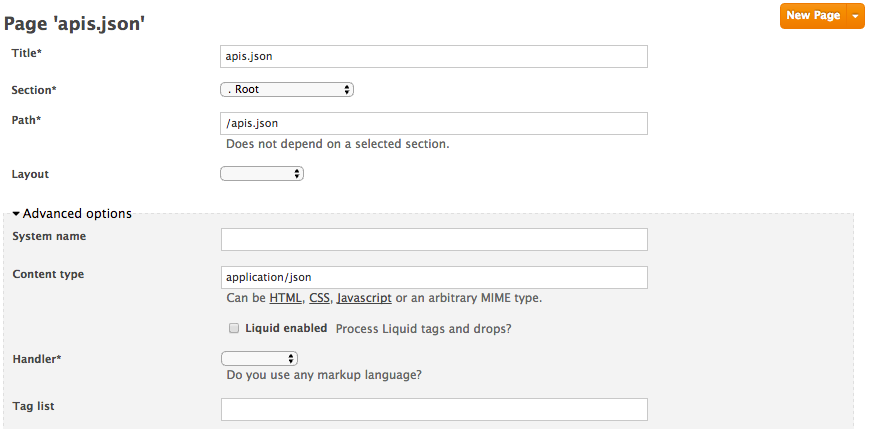

# Automate the delivery of your API documentation using `apis.json`

We partnered with API Evangelist to launch in 2014 the `apis.json` format at [Gluecon](https://www.programmableweb.com/news/apis.io-and-apis.json-launched-gluecon-to-make-api-discoverability-more-search/2014/05/21). The idea is to build something as simple as `robots.txt` for websites but for APIs.
It does not matter the language used to build the APIs, on which platform it runs or which container it runs.

With the launch of `APIs.json` we also launched APIs.io, the search engine for APIs.
Now we are happy announce you can have a similar experience on your developer portal.
Being able to list all your apis, and let your users search easily through them.

You can see a working demo below:


## Prerequesites

* 3scale account with Developer Portal
* a Swagger spec (3scale ActiveDocs) for each service

## Build APIs.json file

You already have an APIs.json file to describe your API? Genius! you can already move to next part.

If you are not familiar with this format I encourage you look at the [specification](https://apisjson.org) first.

To build your file you can use the [builder](http://apis.io/builder) available on [APIs.io](http://apis.io) or any IDE to produce a `.json` file.

For our tutorial we will use this sample [file](../apis.json)
It has two APIs: Voice API, and SMS API.

As you may have seen, we have added vendor extension `X-3scale`. You should add it to each API contained in your `apis.json` file.
Like the following:

```
"X-3scale":{
	"service_id":{THREESCALE_SERVICE_ID},
	"swagger_system_name":"{THREESCALE_ACTIVEDOCS_SYSTEM_NAME}"
}
```

Replace `THREESCALE_SERVICE_ID` by the corresponding ID.
And replace `THREESCALE_ACTIVEDOCS_SYSTEM_NAME` by the system name of the ActiveDocs.

Once you are done, you will be ready to upload it to your developer portal.

## Add APIs.json to Developer Portal

Go under `Developer Portal` section.
Create a new Page named `apis.json`, it has to be under `Root` section.

Under `Advanced options`:

1. Change content-type to `application/json`
2. Make sure liquid tags are disabled
3. Make sure layout filed is blank



This file will now be available on this URL `https://YOURDOMAIN.3scale.net/apis.json`

## Display search experience

We will now create a new page named `apilist`.
We recommend to place it under `Root` section.

You can copy paste the content of [apilist.html](../apilist.html) from this repo into the CMS.

Under `Advanced options`:

1. Make sure liquid tags are disabled

Save and preview, you should see your list of APIs, a search box and the categories on the right.

## API details experience

We will now add the page `apidetails` to display more details about each API.
This page will be displayed when user clicks on an API block in the list, they will be redirected to `/apidetails?service_id={SERVICE_ID}`.

1. Create a new page `apidetails` under `Root` section.
2. Under `Advanced options`: Enable liquid tags
3. Copy paste content from [apidetails.html](../apidetails.html)

Data for `About` and `Documentation` sections are loaded dynamically from `apis.json` file.

Other sections have placeholders that you can easily modify, they will be common to every API. If you want to make them dynamic for each API, add more fields under `X-3scale` section of `apis.json`.

## Test and customize

Your discovery experience is now ready :) Congrats!

The look and feel could be customize using [Bootstrap](https://getbootstrap.com) CSS framework.
